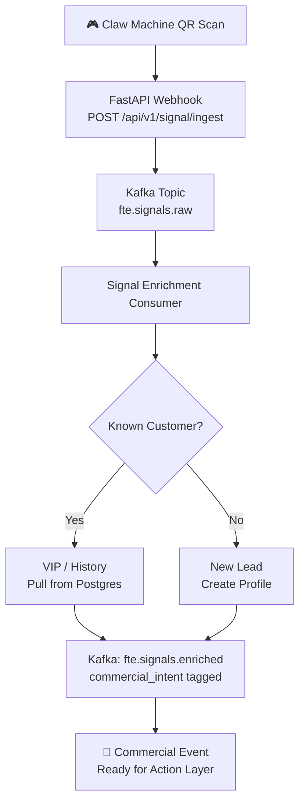
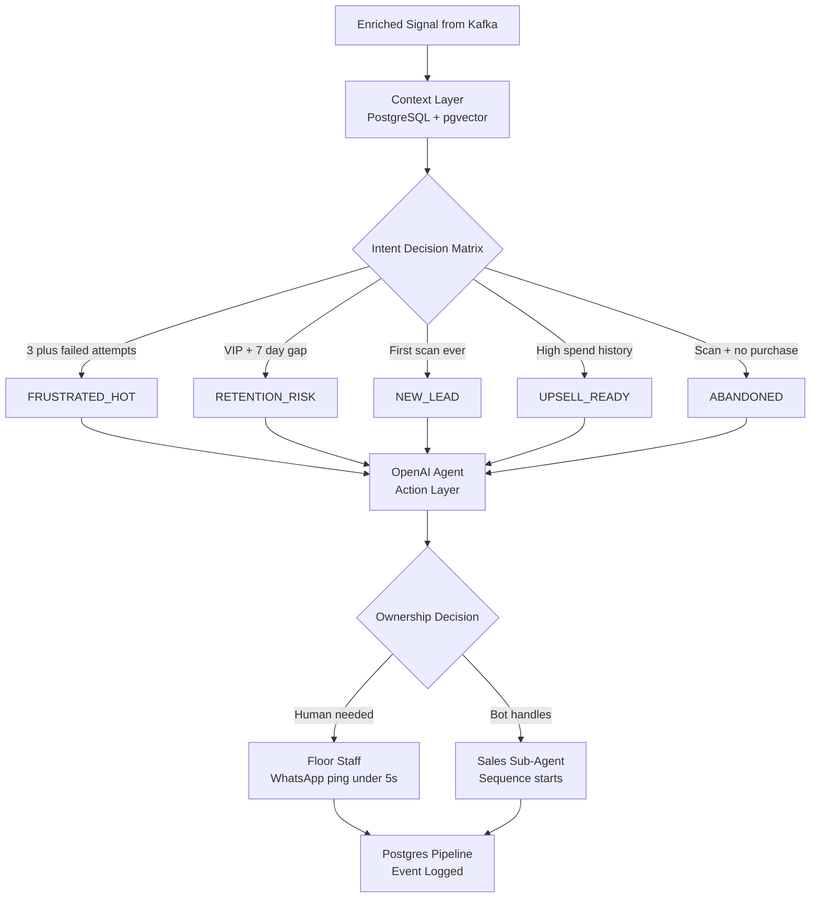
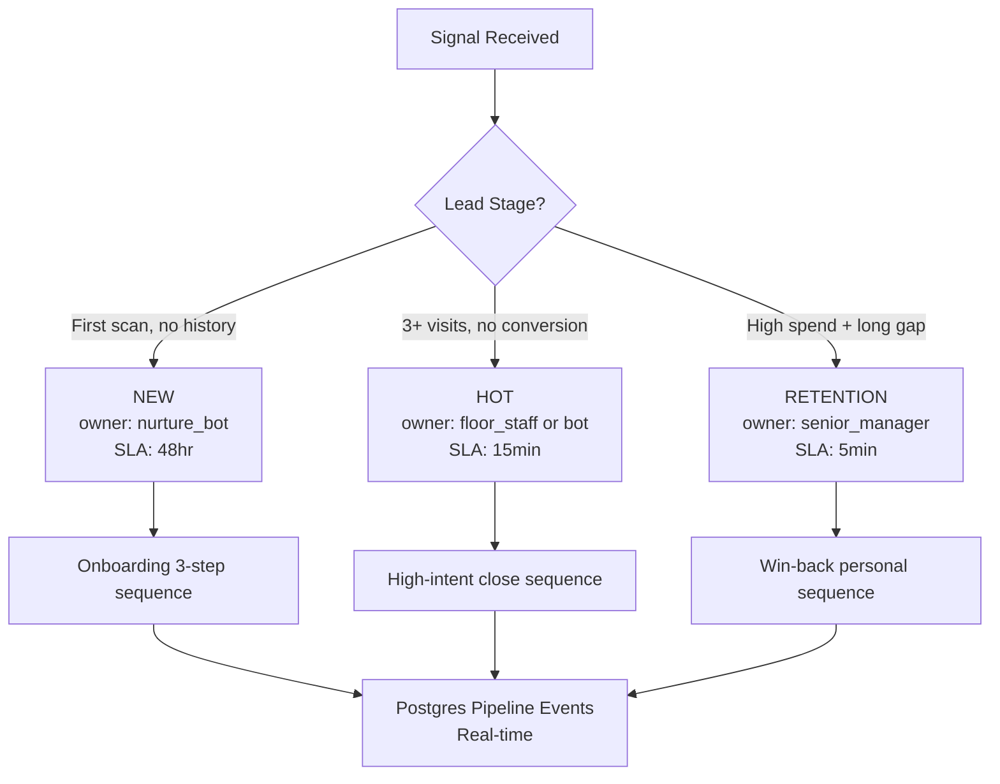
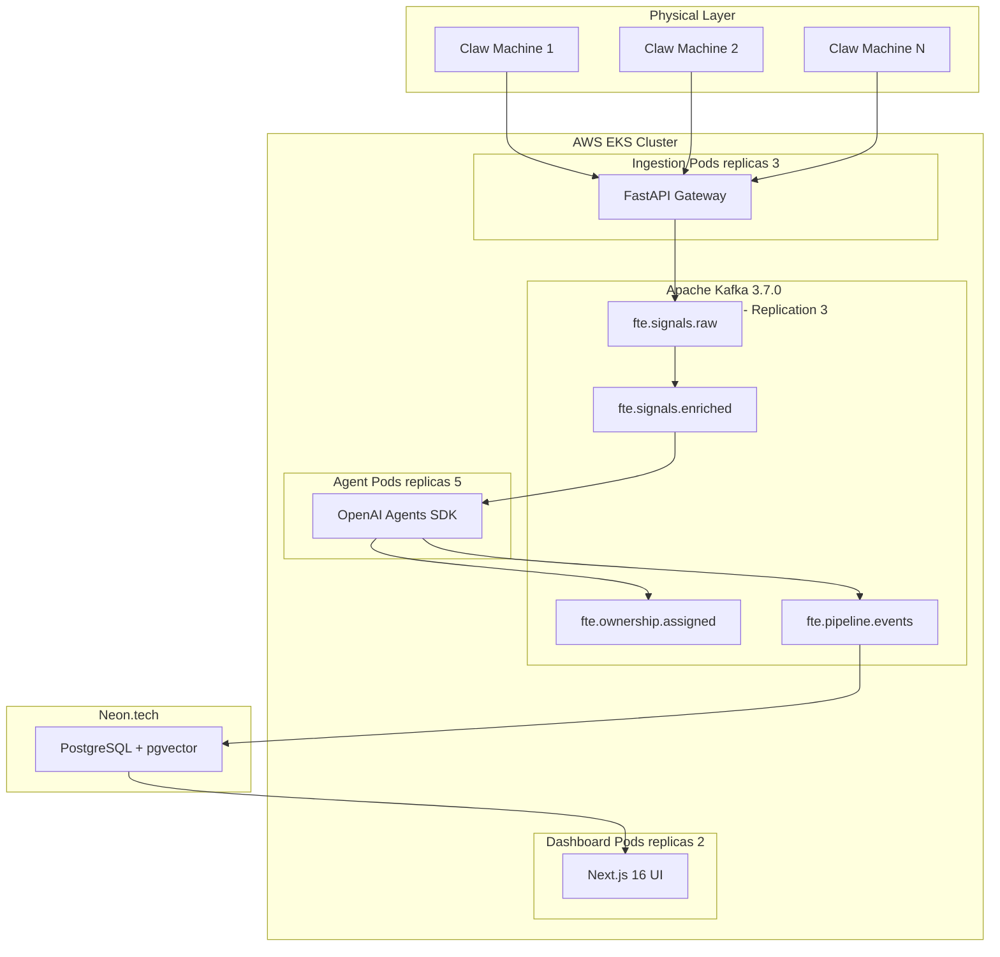

# 🏆 Digital FTE — Signal-to-Revenue Architecture
### Built for: Claw Kingdom × RevLab Intelligence
**Prepared by:** Muhammad Waheed — WaheedAI Solutions | muhammadwaheedairi@gmail.com

---

> **"Most builds capture a signal and update a database field. That's not revenue.**
> **Revenue happens when a signal triggers ownership, a follow-up sequence, and a feedback loop — all within milliseconds."**

---

## 📋 Table of Contents

- [The Problem We're Solving](#-the-problem-were-solving)
- [How We Solve It — At a Glance](#-how-we-solve-it--at-a-glance)
- [Section 1 — Signal-to-Revenue Mapping](#-section-1--signal-to-revenue-mapping)
- [Section 2 — The Missing Link: Context → Action](#-section-2--the-missing-link-context--action)
- [Section 3 — Pipeline Ownership Logic](#-section-3--pipeline-ownership-logic)
- [Section 4 — Infrastructure for Scale](#-section-4--infrastructure-for-scale)
- [Section 5 — Revenue Impact Table](#-section-5--revenue-impact-table)
- [Tech Stack](#-tech-stack)

---

## 🚨 The Problem We're Solving

Baljinder flagged **4 exact gaps** in standard AI builds for Claw Kingdom:

| # | What the Client Said | Why It Kills Revenue |
|---|---|---|
| 1 | *"Signal layer is where commercial value sits"* | QR scans are blind — no identity, no intent, no action |
| 2 | *"Most builds fall short between Context and Action"* | System classifies a lead but nobody owns it |
| 3 | *"Follow-up must tie to commercial outcomes"* | Nurture sequences run but pipeline doesn't move |
| 4 | *"Tie signals directly to pipeline movement + ownership"* | No visibility = managers flying blind |

---

## ✅ How We Solve It — At a Glance

```
Client's Gap                         Our System's Answer
──────────────────────────────────   ──────────────────────────────────────────
Signal has no commercial value    →  Every QR scan = structured Kafka event
Context → Action gap              →  pgvector context decides action in <50ms
Follow-up not tied to outcomes    →  OpenAI Agent triggers ownership + sequence
No pipeline visibility            →  Postgres logs every action in real-time
```

---

## 📡 Section 1 — Signal-to-Revenue Mapping

### How a Raw QR Scan Becomes a Commercial Event

A physical QR scan at a Claw Machine is **commercially blind** by default.
Our ingestion layer makes it a **revenue event** in 3 steps:



### What Gets Added to Every Signal

```json
{
  "signal_id": "uuid",
  "source": "qr_scan",
  "machine_id": "CLW-042",
  "customer_id": "inferred_or_null",
  "location": "floor_zone_B",
  "metadata": { "attempts": 3, "session_ms": 45000 },

  "commercial_intent": "HIGH",
  "lead_stage": "HOT",
  "recommended_action": "DIRECT_SALES"
}
```

> ✅ **Every scan is now a Commercial Event — not just a log entry.**

---

## 🔗 Section 2 — The Missing Link: Context → Action

### The Gap Most Builds Fall Into

```
❌  Typical Build:
    Signal ──► CRM Stage Update ──► Nothing else happens
                                    (no owner, no follow-up, revenue stalls)

✅  Our Build:
    Signal ──► Context Layer ──► Action Layer ──► Owner Assigned + Follow-up Live
```

### Full Context → Action Flow



### Intent Decision Matrix

| Context Signal | Intent Tag | Action Triggered |
|---|---|---|
| 3+ failed attempts | `FRUSTRATED_HOT` | Instant discount via WhatsApp |
| VIP + 7 day gap | `RETENTION_RISK` | Manager alert + callback |
| First scan ever | `NEW_LEAD` | Welcome + 3-step nurture |
| High spend history | `UPSELL_READY` | Direct Sales bot assigned |
| Scan + no purchase | `ABANDONED` | 30-min follow-up trigger |

> ✅ **The Context Layer reads history. The Action Layer creates accountability. No lead goes unowned.**

---

## 🏗️ Section 3 — Pipeline Ownership Logic

### Stage Entry + Routing



### Feedback Loop — What Gets Logged

Every action writes to `pipeline_events` in Postgres in real-time:

| Event Type | What It Means |
|---|---|
| `SIGNAL_RECEIVED` | Raw scan captured |
| `INTENT_TAGGED` | Context layer classified the lead |
| `OWNER_ASSIGNED` | Human or bot assigned |
| `SEQUENCE_STARTED` | Follow-up initiated |
| `SEQUENCE_RESPONDED` | Customer replied or clicked |
| `STAGE_ADVANCED` | Lead moved forward or churned |
| `REVENUE_LOGGED` | Purchase confirmed |

**Management Dashboard (Next.js 16) shows:**
- Live pipeline view: `NEW` / `HOT` / `RETENTION` / `CLOSED`
- Per-machine revenue attribution
- Owner performance — bot vs human close rate
- Which trigger sequences convert best

---

## ☁️ Section 4 — Infrastructure for Scale

### Full System Architecture



### Reliability Guarantees

| Feature | What It Does |
|---|---|
| Kafka partitions (12) | Parallel processing — no bottleneck at peak hours |
| Replication factor 3 | Zero message loss even if 2 brokers fail |
| EKS auto-scaling | Handles burst scan traffic at busy periods |
| Neon.tech serverless | Auto-scale Postgres, zero cold starts |
| Dead Letter Queue | Every failed Kafka event auto-retried |

---

## 💰 Section 5 — Revenue Impact Table

| Signal | Commercial Logic | Revenue Outcome |
|---|---|---|
| 🆕 QR Scan — 1st time | New lead + welcome via WhatsApp | +15–25% return visit rate |
| 😤 3 failed attempts | Instant discount in <5 seconds | Converts frustration → purchase |
| 👑 VIP — 7+ day gap | Manager alert + personal offer | VIP retention = 5–10x new lead value |
| 👻 Scan + no purchase | 30-min re-engagement trigger | +30% recovery on warm leads |
| 💎 High spend history | Direct sales bot assigned | Higher AOV, upsell conversion |
| 👤 Human escalation | Staff SLA: 15 min + RED alert | No high-value lead left cold |
| 🔁 Sequence completed | A/B data logged to Postgres | Continuous revenue optimization |

---

## 🛠️ Tech Stack

| Layer | Technology |
|---|---|
| **Ingestion** | FastAPI + Apache Kafka 3.7.0 |
| **Context** | PostgreSQL + pgvector (Neon.tech) |
| **Action** | OpenAI Agents SDK |
| **Channels** | WhatsApp (Twilio) + Gmail + Web Form |
| **Frontend** | Next.js 16 |
| **Infrastructure** | AWS EKS + Kubernetes + Docker |

---

## 👨‍💻 Built By

**Muhammad Waheed** — Lead Engineer, WaheedAI Solutions
- 📧 muhammadwaheedairi@gmail.com
- 🐙 github.com/muhammadwaheedairi

---

> *"Most builds stop at the signal. Ours starts there."*
