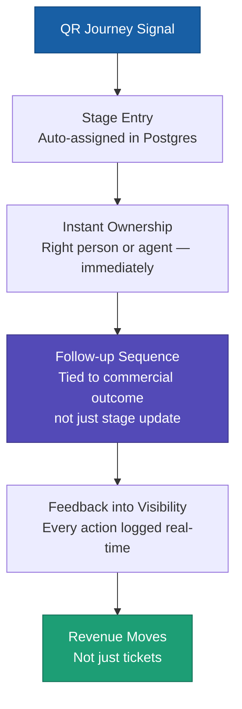
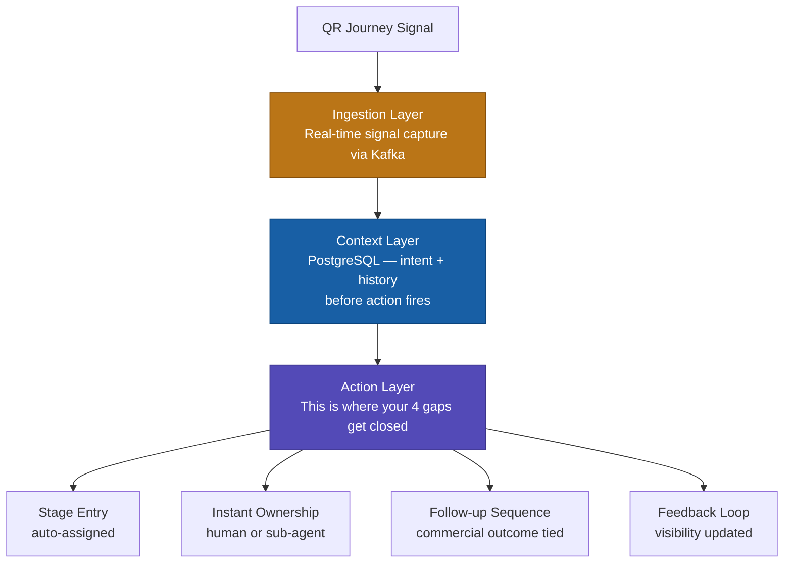
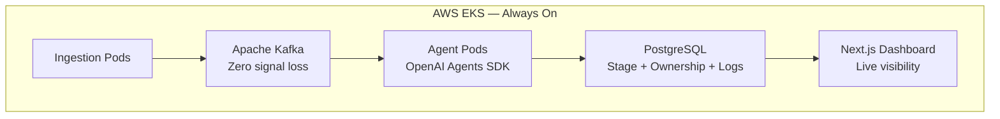

# Digital FTE — Claw Kingdom Signal-to-Revenue Architecture
**By:** Muhammad Waheed — WaheedAI Solutions

---

> *"Revenue still stalls if follow-up logic isn't tied to commercial outcomes — not just stages updating."*
> — Baljinder Lally, RevLab Intelligence

---

## The Problem You Described

Most builds get the routing right. But revenue still stalls. Why?

```
❌ What most builds do:
   Signal → Stage Update → Done
   (Technically clean. Commercially blind.)

✅ What we do:
   Signal → Stage Entry → Instant Ownership → Follow-up → Revenue Visibility
```

---

## How We Close All 4 Gaps



---

## The 3-Layer Architecture



---

## Your 4 Gaps — Closed

| Your Exact Concern | How We Handle It |
|---|---|
| Stage Entry | Signal auto-assigns lead stage in Postgres instantly |
| Instant Ownership | Kafka event fires — right person or agent owns it immediately |
| Follow-up tied to commercial outcomes | Action Layer triggers revenue-focused sequence — not just a status update |
| Feedback into visibility | Every action logged real-time — management sees what's moving |

---

## Signal → Commercial Outcome

| Signal | Commercial Logic | Outcome |
|---|---|---|
| QR scan — first time | New lead, stage auto-assigned, sequence starts | Pipeline entry — not just a log |
| 3+ failed attempts | Frustration detected, ownership triggered instantly | Churn prevented |
| High intent, no conversion | Abandoned — follow-up tied to offer, not just reminder | Revenue recovered |
| VIP signal — long gap | Retention risk flagged, senior ownership assigned | VIP protected |

---

## Infrastructure That Supports It



---

> *"The agent is just the engine. The real value is in Signals → Pipeline mapping."*

**Stack:** FastAPI · Kafka · PostgreSQL · OpenAI Agents SDK · Next.js 16 · AWS EKS

---
*Muhammad Waheed — WaheedAI Solutions · muhammadwaheedairi@gmail.com*
